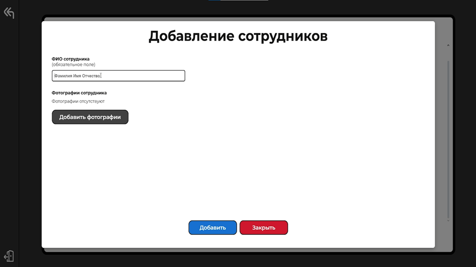

# Frontend веб-приложения для распознавания лиц

## О проекте

Проект представляет собой frontend веб-приложения для системы видеонаблюдения с использованием технологии распознавания лиц. Разработка проекта проводилась в рамках выпускной квалификационной работы.

## Установка

Установить зависимости проекта: `npm install`

Собрать проект: `npm run build`

Запустить проект на localhost: `npm run start`

## Использованные технологии

-   JavaScript
-   React
-   Redux
-   Jest

## Скришоты пользовательского интерфейса

### Страница входа

### Главная страница с камерами

### Настройки приложения

### Добавление сотрудников в базу

